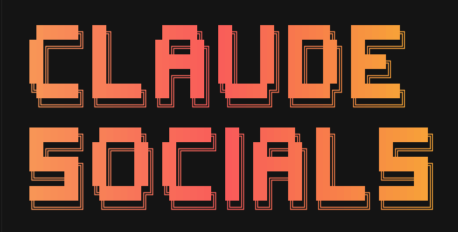

<p align="center">
  
</p>

# claude-socials

A collection of skills for posting content to social media platforms — directly from your terminal or AI-assisted workflows. Supports **Claude Code**, **OpenAI Codex**, and **Hermes Agent** (Nous Research).

Browser-based skills use [Playwright MCP](https://github.com/microsoft/playwright-mcp) for automation. API-based skills (like `threads-post`) call platform REST APIs directly — no browser required.

---

## Available Plugins

| Plugin | Platform | Status |
|---|---|---|
| [`hn-submit`](./plugins/hn-submit/) | Hacker News | ✅ Available |
| [`threads-post`](./plugins/threads-post/) | Meta Threads | ✅ Available |

More platforms coming soon (Reddit, LinkedIn, Twitter/X, Lobsters, ...).

---

## Supported Agents

| Agent | Install path |
|-------|-------------|
| [Claude Code](https://claude.ai/code) | Plugin marketplace → `plugins/` |
| [OpenAI Codex](https://developers.openai.com/codex/skills) | `$HOME/.agents/skills/` |
| [Hermes Agent](https://hermes-agent.nousresearch.com) | `hermes skills tap` or `$HOME/.hermes/skills/` |

---

## Install

### One-liner (auto-detects Claude Code, Codex, and Hermes)

```bash
curl -fsSL https://raw.githubusercontent.com/adityak74/claude-socials/main/scripts/install.sh | sh -s -- hn-submit
curl -fsSL https://raw.githubusercontent.com/adityak74/claude-socials/main/scripts/install.sh | sh -s -- threads-post
```

The installer detects whichever of `claude`, `codex`, and `hermes` are on your `$PATH` and installs into each. Override with `--agent <claude|codex|hermes|all>`:

```bash
# Install only into Codex
curl -fsSL https://raw.githubusercontent.com/adityak74/claude-socials/main/scripts/install.sh | sh -s -- hn-submit --agent codex

# Install into all agents explicitly
curl -fsSL https://raw.githubusercontent.com/adityak74/claude-socials/main/scripts/install.sh | sh -s -- threads-post --agent all
```

> After installing, restart your agent to activate the skills.

### Claude Code (manual)

Inside Claude Code:
```
/plugin marketplace add adityak74/claude-socials
/plugin install hn-submit@claude-socials
/plugin install threads-post@claude-socials
```

Or from the terminal:
```bash
claude plugin marketplace add adityak74/claude-socials
claude plugin install hn-submit@claude-socials

# Project scope — shared with your team via .claude/settings.json
claude plugin install threads-post@claude-socials --scope project
```

---

## Prerequisites

Some plugins use **Playwright MCP** for browser automation; others (like `threads-post`) call REST APIs directly and have no Playwright dependency.

### Playwright MCP (for browser-based plugins)

### 1. Install Playwright browsers

```bash
npx playwright install
```

### 2. Configure Playwright MCP in Claude Code

Add to your MCP config globally (`~/.claude/claude_desktop_config.json`) or per-project (`.mcp.json`):

```json
{
  "mcpServers": {
    "playwright": {
      "command": "npx",
      "args": ["@playwright/mcp@latest"]
    }
  }
}
```

See the [Playwright MCP repo](https://github.com/microsoft/playwright-mcp) for full options (headed/headless mode, browser choice, auth persistence).

---

## Usage

Once a plugin is installed, trigger it with natural language or the skill command.

### Hacker News

```
/hn-submit
```

Or just describe what you want:

```
Post this to HN
Submit to Hacker News — title: "My Article", URL: https://example.com/my-article
Share on HN
```

The agent handles login (via credentials) and submission automatically.

### Threads

The `threads-post` plugin includes four skills — Claude picks the right one based on what you describe:

| Skill | Trigger |
|-------|---------|
| `threads-post` | "post this to Threads", "share on Threads" |
| `threads-post-carousel` | "carousel on Threads", "post multiple images to Threads" |
| `threads-post-thread` | "create a thread", "thread this article" |
| `threads-post-spoiler` | "spoiler post on Threads", "hide this behind a spoiler" |

```
/threads-post
/threads-post-carousel
/threads-post-thread
/threads-post-spoiler
```

Or describe what you want:

```
Post this article to Threads
Create a thread chain from this blog post
Share these 5 images as a carousel on Threads
Post this plot twist as a spoiler
```

Claude drafts the post(s), shows them to you for approval, then publishes via the Meta Graph API.

---

## Credentials

Skills read credentials from environment variables — never hardcoded values.

Create a `.socials` file in your project root (it is gitignored by default):

```
# Hacker News
HN_USERNAME=your_username
HN_PASSWORD=your_password

# Meta Threads
THREADS_USER_ID=123456789
THREADS_ACCESS_TOKEN=EAAxxxxxxxxxxxxx
```

Or export in your shell:

```bash
export HN_USERNAME=your_username
export HN_PASSWORD=your_password
export THREADS_USER_ID=123456789
export THREADS_ACCESS_TOKEN=EAAxxxxxxxxxxxxx
```

Each skill's `SKILL.md` documents which env vars it requires and how to obtain them.

---

## Plugin Reference

### [`hn-submit`](./plugins/hn-submit/)

Submits a URL to [Hacker News](https://news.ycombinator.com/submit).

**Requires:** `HN_USERNAME`, `HN_PASSWORD`

**Trigger:** `/hn-submit` or phrases like "post to HN", "submit to Hacker News", "share on HN"

**What it does:**
1. Logs in to your HN account via Playwright
2. Navigates to the submit page
3. Fills in the title and URL
4. Submits and reports back with the thread URL

---

### [`threads-post`](./plugins/threads-post/)

Publishes content to Meta Threads via the Graph API. Includes four skills:

| Skill | Description | Requires |
|-------|-------------|----------|
| `threads-post` | Single text or image post | `threads_basic`, `threads_content_publish` |
| `threads-post-carousel` | Up to 10 images/videos in one post | `threads_basic`, `threads_content_publish` |
| `threads-post-thread` | Root post + linear reply chain | `threads_basic`, `threads_content_publish`, `threads_manage_replies` |
| `threads-post-spoiler` | Tap-to-reveal spoiler post (text, media, or both) | `threads_basic`, `threads_content_publish` |

**Requires:** `THREADS_USER_ID`, `THREADS_ACCESS_TOKEN`

**No Playwright required** — calls the Meta Graph API directly with `curl`.

---

## Contributing

Contributions are welcome. To add a skill for a new platform:

1. **Claude Code** — Create `plugins/<platform-name>/`, add `.claude-plugin/plugin.json`, and add `skills/<platform-name>/SKILL.md` with a `description` frontmatter field and the full workflow. Add an entry to `.claude-plugin/marketplace.json`.
2. **Codex** — Add `agents/codex/skills/<platform-name>/SKILL.md` with `name` + `description` frontmatter tuned for Codex's implicit-invocation matching.
3. **Hermes** — Add `agents/hermes/skills/social-media/<platform-name>/SKILL.md` with full Hermes frontmatter (`version`, `author`, `metadata.hermes`, `required_environment_variables`).
4. Open a PR.

### Per-agent skill source layout

```
plugins/                          # Claude Code marketplace (do not restructure)
agents/codex/skills/              # Codex — flat skill dirs
agents/hermes/skills/social-media/ # Hermes — category-grouped skill dirs
```

### Conventions

- Store credentials in `.socials` (gitignored); never hardcode them
- Handle rate limits, login failures, and duplicate submissions gracefully
- Use Playwright MCP for browser automation (browser-based skills only)
- Bump `version` in `plugin.json` and the marketplace entry on every release

---

## License

MIT
